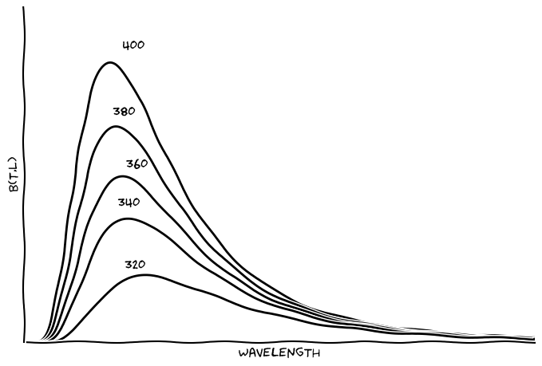

Title: Wien's law step by step
Date: 2016-05-11 17:55
Slug: test-md
Author: Jose Dias

The Wein's displacement law is obtained from Planck's law.
Wein's law states that the product between wavelength, for a maximum emissivity, and
body's temperature $(T)$, is a constant. In other words, if we know the body's temperature,
we'll be able to determine the wavelength were the maximum emissivity occur.

The Planck's law is given by:

\begin{equation}
\label{eq1}
B(T,\lambda) = \frac{2hc^{2}}{\lambda^{5}(exp(\frac{hc}{kT})-1)}
\end{equation}

The figure below shows a family of emissivity curves for five values of $T$.

{:style="float:right;width:90%;margin:10px"}

Hereafter, we'll show how the Wein's law cam be found.

For simplicity, let's define $\alpha\equiv 2hc^{2}$ and $\gamma\equiv \frac{hc}{kT}$

Then, the equation \ref{eq1} becomes:

\begin{equation}
\label{eq2}
B(\gamma, \lambda) = \alpha\lambda^{-5}(exp(\frac{\gamma}{\lambda})-1)^{-1} 
\end{equation}

But, what we want to find? We are interested to find in which wavelength occur 
the maximum emissivity. For this, we need to make $\frac{\partial B}{\partial \lambda}=0$. 

\begin{equation}
\begin{split}
 \frac{\partial B}{\partial \lambda}=\alpha\lambda^{-6}(exp(\frac{\gamma}{\lambda})-1)
[-5+ \\ \gamma\lambda^{-1}(exp(\frac{\gamma}{\lambda})-1)^{-1}exp(\frac{\gamma}{\lambda})] =0
\end{split}
\label{eq3}
\end{equation}

The solution of equation \ref{eq3} is found doing the factor inside of brackets equal
to zero. 

\begin{equation}
-5+ \gamma\lambda^{-1}(exp(\frac{\gamma}{\lambda})-1)^{-1}exp(\frac{\gamma}{\lambda}) =0
\label{eq4}
\end{equation}

After reordering all the factors in \ref{eq4}, we will get the equation bellow.

\begin{equation}
\lambda[\exp(\frac{\gamma}{\lambda})(\frac{\gamma}{\lambda}-5)+5]=0
\label{eq5}
\end{equation}

Once that $\lambda$ is different of zero, the factor inside of brackets has to be
zero. 

\begin{equation}
exp(\frac{\gamma}{\lambda})(\frac{\gamma}{\lambda}-5)+5=0
\label{eq6}
\end{equation}

The equation \ref{eq6} is a transcendental equation, that means, it is not 
possible to solve by traditional way. For simplicity, we will define 
$g\equiv \frac{\gamma}{\lambda}$. Following, the last equation becomes 

\begin{equation}
exp(g)(g-5)+5=0
\label{eq7}
\end{equation}

So, how to solve it? One way cam be expressing exponential function by an approximation
using Taylor's series. Another way is to use graphical method (For the moment, we'll 
demonstrate just the first way).

\begin{equation}
exp(g)=1+g+\frac{g^2}{2}
\label{eq8}
\end{equation}

After replacing $\ref{eq8}$ in $\ref{eq7}$; we get:

\begin{equation}
(1+g+\frac{g^2}{2})(g-5)+5=0
\label{eq9}
\end{equation}

After reorganize, we find that: 

\begin{equation}
g(-4-\frac{3g}{2}+\frac{g^2}{2})=0
\label{eq10}
\end{equation}

According definition $g$ is different of zero; so, the expression inside of brackets 
has to be equal to zero. This equation is a second degree equation; then, we may conclude
that $g$ is a constant. 

Therefore,

\begin{equation}
g=\frac{\gamma}{\lambda}=\frac{hc}{kT\lambda}=constant \Rightarrow {\lambda}{T}=constant
\end{equation}

**Quod erat demonstrandum**.
