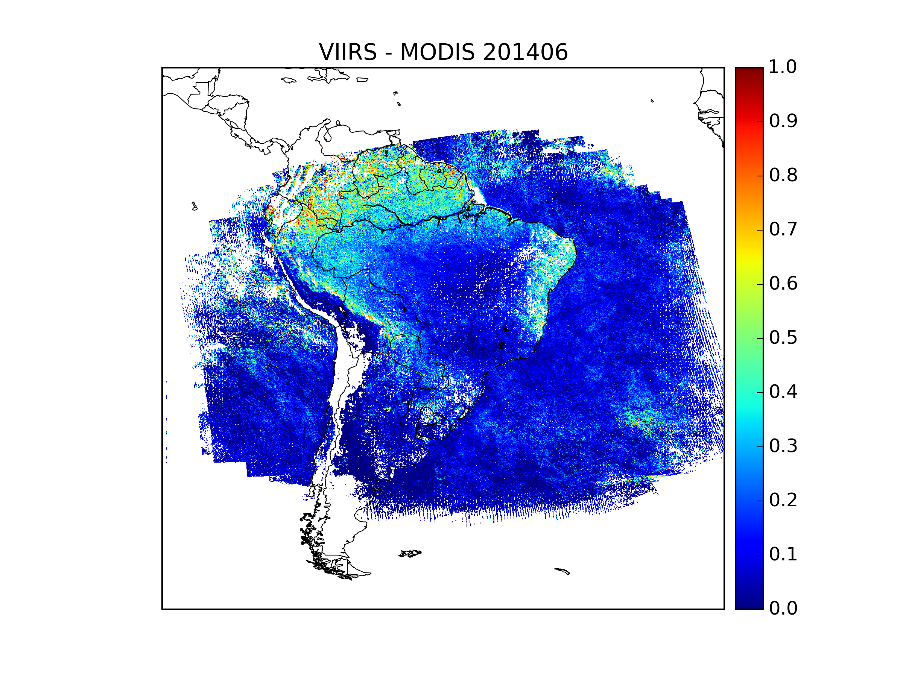

Aerosol Data Validation in Brazil
#################################
:date: 2016-04-12 23:41
:author: Jose Dias
:category: Professional
:slug: aot-validation

In Oct. 28, 2011 the Suomi National Polar-orbiting Partnership spacecraft was launched. 
It is a result of a collaboration between NASA and NOAA. 
This spacecraft is composed by five sensors designed to monitor the Earth System. 
One of them is the Visible Infrared Imaging Radiometer Suite (`VIIRS`_).
One possible application of such sensor is to monitor Aerosol Optical Thickness.  
In Brazil, the National Institute For Space Research (INPE) is the data center for
environmental satellite data.

In particular, my job at INPE is to evaluate the performance of Aerosol Optical Thickness (AOT) in 
Brazil. The core of this procedure is to compare AOT retrieved by VIIRS with AOT measured in the
AERONET sites and with the AOT retrieved by `MODIS`_ sensor. This project is under supervision of Dr.
`Sievert`_. 

The figure above shows the spatial difference for VIIRS and MODIS AOT data for June, 2014. 
The collection of results for this project is hosted in `AOT Results`_.

.. _AOT Results: http://gauss.geofisica.ufrn.br/~ionosfera/zedias/aot/

.. _VIIRS: http://npp.gsfc.nasa.gov/viirs.html

.. _MODIS: http://modis.gsfc.nasa.gov/about/

.. _Sievert: http://lattes.cnpq.br/2921337850760630
